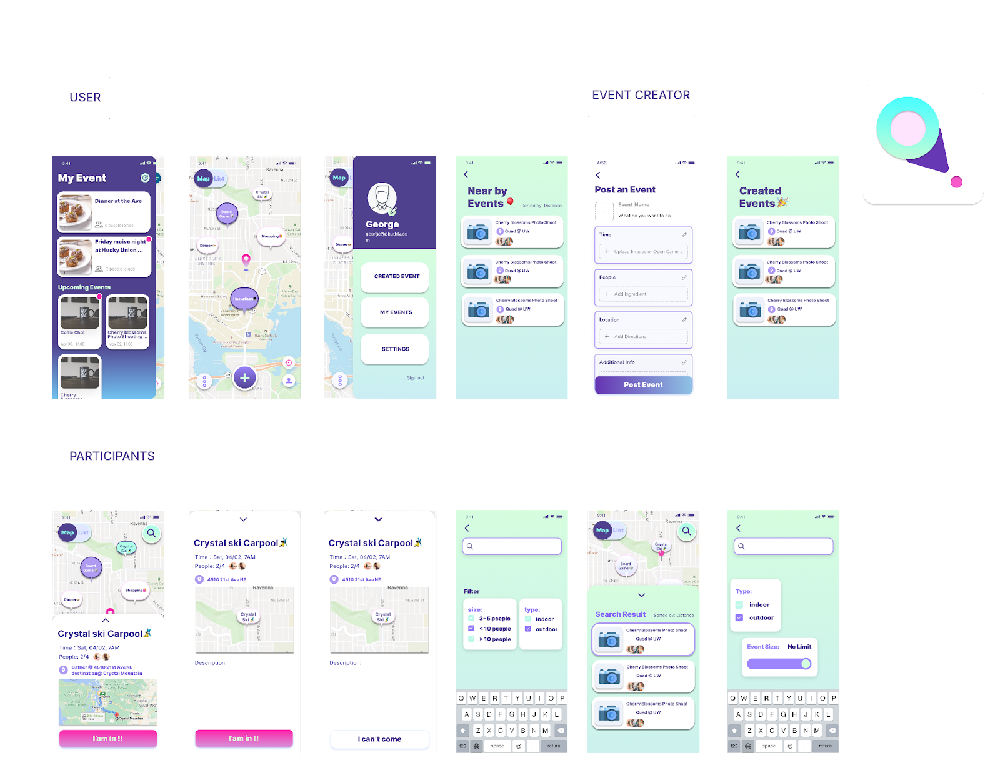

# AroundU

**Team Members:**
| Name | Role | 
| --- | ----------- | 
| George Ma | Product Manager | 
| Wei Wu | UI/UX Developer, Backend Developer | 
| Wenxin Zhang | Backend Developer |
| John Wang | Frontend Developer, Deployment Developer | 
| Melody Zhang | Frontend Developer | 
| Vandy Zhang | Frontend Developer |

**Project Summary**:

> A platform for college student to post and find events within the university community.

**Documentation**
- User Manual
  - The detailed user manual is in [User Manual](./UserManual.md)
- Development Guidelines: 
  - The detailed onboaring document is in `/frontend` and `/backend`. Refer to those README document for setup, build, test,
and deploy application, or checkout [Developer Guideline](./DeveloperGuidelines.md) . For technical documentation, please refer to our Notion documents regarding [API](https://www.notion.so/API-Doc-3249a636b9d94522b2d2e3ead52f0872) and [Database](https://www.notion.so/Database-Doc-8ecade5f05394ab9a7dba1c80fa6cbc6)
doc.

**Project Description:**

Our goal is to allow user(students) more easy to find events or activities around them, and build connection or
friendship with other through those events. With that idea, we believe that an interactive map-based interface would be
a good approach to communicate with the user, and encourage user to attend events around them. As almost all in-person
events or activity are naturally associate with a location, it is more intuitive for the user to found what events are
available in a map. Besides, map can also be a media that connect the virtual contents to the reality, giving the user a
sense of authenticity and trust, which is commonalty lacking in today's social media.

**Main features:**

1. Register and validate user account: User can create an account via Email
2. Create an event or activity: User able to create/post an event by filling out some require info, like event title,
   time, size, and location. etc.
3. Join or leave an event or activity: User should be able to join or leave a specific selected event or activity.
4. Interactive map-based interface: Display the events/activities in an interactive map-based interface. Allowing the
   user to interactive with the map element to preform verity of task like see, found, and join specific event or
   activity.
To be added:
5. Manage events/activities: Event initiator is able to edit the event details, like change time and event size .

Check out most up-to-date web version of AroundU at [https://aroundu-403.web.app/#/](https://aroundu-403.web.app/#/)

**Prototype Use case**

- Actor: User
- Precondition: A new User first download our app and want to find a event that neer him to participate
- Postconditions: the user successfully joins an event that interested him the most.
- List of step:
    1. register a account with Email address
    1. Enter to the Map View home page
    2. interact with the Map, and discover events on the map
    3. click on an event that interested him the most
    4. look at the event info on the event detail page
    5. click on the `join event botton` to join the event

- Internal Implementation
    1. our Account System utilizes Firebase API to connect the frontend and backend, allowing the user account info
       safely and securely transfer and store encrypted in our database.
    2. Our Map View is powered by the Mapbox framework, which allows users to interact with the real-world map.
    3. We implemented an Event API, which fetches all event data around the user's physical location from our database,
       then displays them on the map.
    4. Each event has detailed information including location, time, size, description, etc
    5. We implemented a join event API, which will update the selected event in our database.

## Repository Layout

1. `/report`: all the weekly status report
2. `/backend`: major components in backend service folder. For details, please checkout backend/README.md
    1. Data Access Object (DAO): model database entities
    2. Data Transfer Object (DTO): model HTTP request and response entities
    3. Data Transfer Layer (DTL): controls data access from database
    4. `SparkServer`: APIs with database connections
3. `/frontend`: frontend Flutter folder

## Contribution Policy

Currently, the frontend and backend developers work in pairs to develop the codebase. Each pair work together to build
new features, and we cross-check each other's work before the weekly meeting and leave constructive feedback. After the
meeting, we will go back to fix the issues based on the feedback. We implement this progress because we are often
experiencing with new features and face fast turnover rate. Those features need to be viewed by others, in the main
branch, to make further progress. With the fork branch and merge back method, our development will often be blocked by
unmerged changes. Therefore, we believe this approach is the best practices given our situation. The ultimate goal is to
write better code not following the industrial process. What worked for established codebase may not work for our
situation.

Side note: George is our product manager who is mainly responsive to writing documentation and coordinating project
progress. He contributed to our project by developing the team vision not just the code.

## Developer Instructions:

See `/backend` and `/frontend` directory for details on required installations, setups, and running steps, or checkout [Developer Guideline](./DeveloperGuidelines.md)

